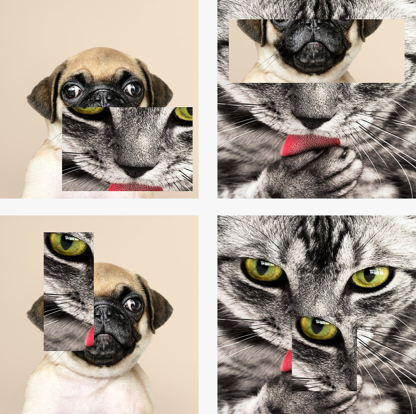

# Patch Augmentation
*Patch Augmentation* is an novel image augmentation technique designed to improve model generalisation and mitigate against adversarial attacks.

For details, see the following pre-print: **Patch augmentation: Towards efficient decision boundaries for neural networks**, *arXiv:1911.07922*, Nov. 2019, <https://arxiv.org/abs/1911.07922>

## How it works

*Patch Augmentation* is a data-independent approach that creates new image data based on image/label pairs, where a patch from one of the two images in the pair is superimposed on to the other image, creating a new augmented sample. 

Below is a visual example of the technique:

The augmented image label is a combination of the image pair's original labels. The labels for the dog and cat classes are `[1.0, 0.0]` and `[0.0, 1.0]` respectively. Clockwise from the upper left, the augmented image's labels are `[0.72220625, 0.27779375]`, `[0.2832, 0.7168]`, `[0.0, 1.0]`, and `[0.918925, 0.081075]` respectively.

A notebook containing a reproducible experiment (training ResNet20v1 using the CIFAR-100 data set) can be found in the following notebook:

[Patch-Augmentation-CIFAR-100.ipynb](Patch-Augmentation-CIFAR-100.ipynb)

In the notebook above, *Patch Augmentation* improves a baseline accuracy of about 45% to over 61%.

The table below shows the technique being applied to several data sets and network architectures:

| Model/Dataset |            | No Augmentation | Patch Augmentation  |
|---------------|------------|-----------------|---------------------|
| CIFAR-10      | ResNet20v1 | 80.86%          | **89.33%**          |
|               | ResNet29v2 | 83.15%          | **91.19%**          |
| CIFAR-100     | ResNet20v1 | 44.08%          | **61.41%**          |
|               | ResNet29v2 | 52.21%          | **68.06%**          |

## Robustness Against Adversarial Attacks

Initial experiments show networks trained with *Patch Augmentation* are more robust to adversarial attacks, see the following notebook for details:

[Adversarial-Examples.ipynb](Adversarial-Examples.ipynb)

Using the Fast Gradient Sign Method to create adversarial examples, the network trained with *Patch Augmentation* had an accuracy of 72.5% versus 64.3% compared to the network trained without augmentation.

## Publication
Publication in review.

Pre-print available here: **Patch augmentation: Towards efficient decision boundaries for neural networks**, *arXiv:1911.07922*, Nov. 2019, <https://arxiv.org/abs/1911.07922>

Repository made public on the 25th of October 2019.
