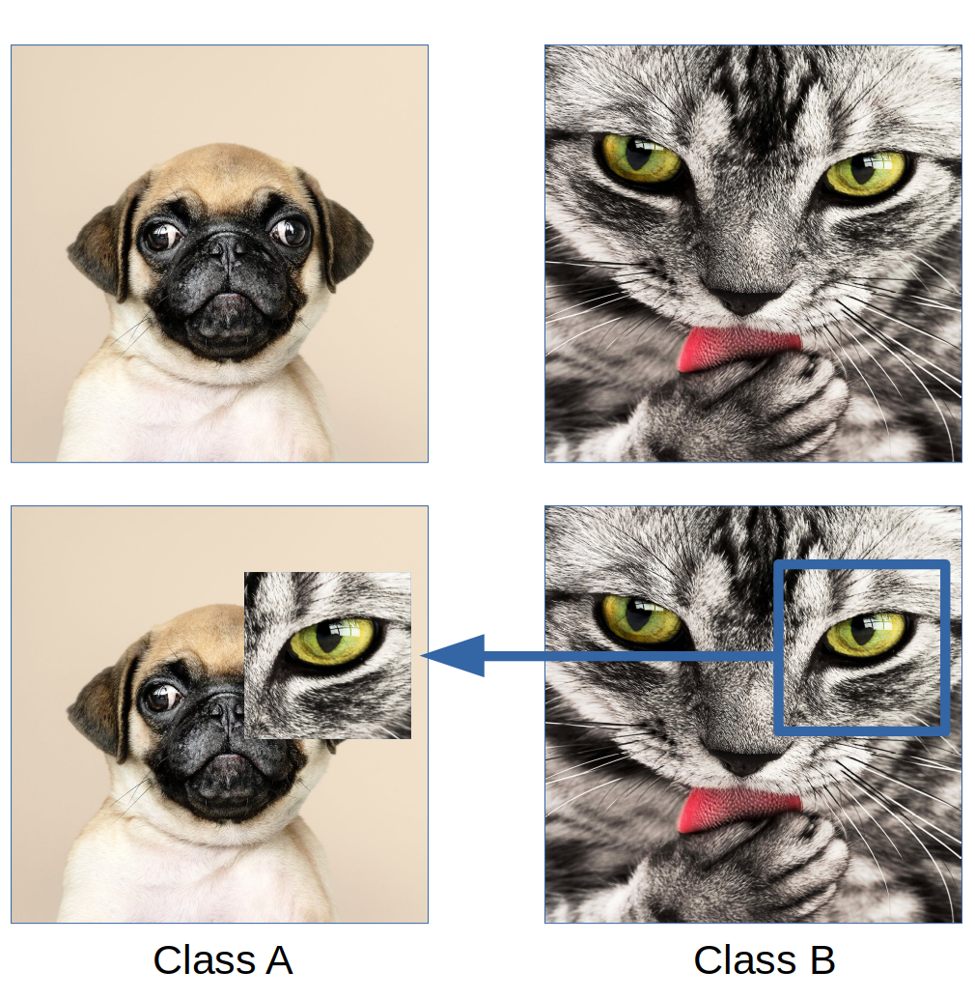

# Patch Augmentation
*Patch Augmentation* is an novel image augmentation technique designed to improve model generalisation and mitigate against adversarial attacks.

## How it works

*Patch Augmentation* is a data-independent approach that creates new image data based on image/label pairs, where a patch from one of the two images in the pair is superimposed on to the other image, creating a new augmented sample. 

A notebook containing a reproducible experiment (using ResNetv1 and ResNetv2 on the CIFAR-10 and CIFAR-100 datasets) can be found in the following notebook:

[Patch-Augmentation.ipynb](Patch-Augmentation.ipynb)

Initial *Patch Augmentation* experiments show a several percent improvement over baseline accuracies.  

## Robustness Against Adversarial Attacks

Initial experiments show networks trained with *Patch Augmentation* are more robust to adversarial attacks, see the following notebook for details:

[Adversarial-Examples.ipynb](Adversarial-Examples.ipynb)

Using the Fast Gradient Sign Method to create adversarial examples, the network trained with *Patch Augmentation* had an accuracy of 72.5% versus 64.3% for the network trained without augmentation.

## Visual Example

Below is a visual example of the technique:

In the case of the example above, a 25% area patch from Class B is superimposed on to the image from Class A. Its new label is `y = [0.75, 0.25]`.

## Publication

Repository made public on the 25th of October 2019. Publication in review.
